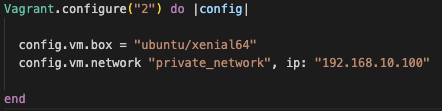
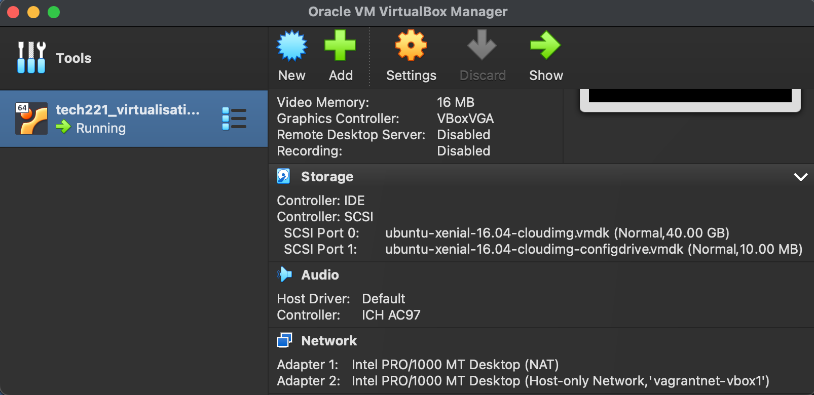
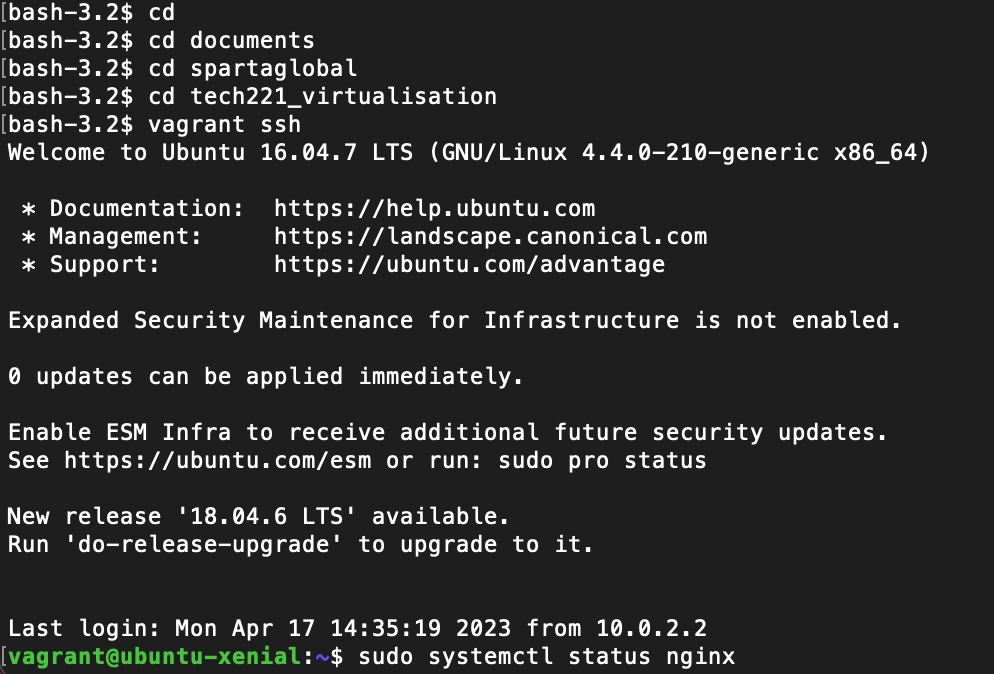
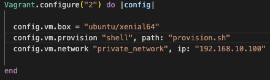
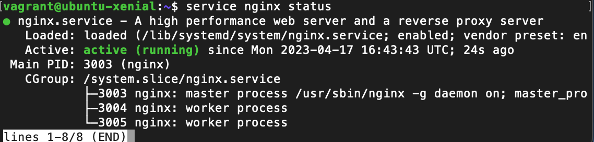

# Virtualisation

### What is virtualisation?

Virtualization is the technology that creates virtual versions of various resources such as the operating system, server, storage etc. thus allowing software to replicate hardware functionality and resulting in the creation of a virtual system independent from the hardware.

### What is a Dev Environment? and what is its purpose?

A Dev Environment is a workspace where developers can run, test and deploy certain applications in a closed environment, you can think of this as a test environment. 

The purpose of this is so developers can test certain things before pushing it to actual live environment where these new features may have issues.

### How to create a VM using vagrant & VirtualBox

1. First step is to make sure vagrant and virtualbox are both downloaded and installed onto your local machine. 

2. Create a Folder where you want to store your VM. 

3. Within VSCode open this folder and in the terminal run, `vagrant init` will initialise the vm on your loacl machine 

4. You will have a file created within your folder named "Vagrant file", this file needs to ammended to look like: 



5. You can now go back to the terminal and run `vagrant up`. To make sure our VM has been created move to our VirtualBox tab and our VM should be "Running".



6. Moving to our terminal/bash window if we use the command `vagrant ssh`, we use this to access the vm. we should recieve a welcome message as so:



### Installing Nginx on our VM using provisioning

1. The first step we need to do is in our Vagrantfile, we need to add a configeration step to allow provision with its path:


 
2. We now need to write our script file in the same directory, called "provision.sh":

```
sudo apt-get -y update 

sudo apt-get -y upgrade 

sudo apt install nginx -y 

service nginx start
```

3. We are now ready to `vagrant up`, we can check our vm is up and running with nginx installed by copying the IP into our browser where we should be greeted with the nginx home screen, or using `service nginx status` and returned with a green "active (running)" message.



