# Virtualisation

### What is virtualisation?

Virtualization is the technology that creates virtual versions of various resources such as the operating system, server, storage etc. thus allowing software to replicate hardware functionality and resulting in the creation of a virtual system independent from the hardware.

### What is a Dev Environment? and what is its purpose?

A Dev Environment is a workspace where developers can run, test and deploy certain applications in a closed environment, you can think of this as a test environment. 

The purpose of this is so developers can test certain things before pushing it to actual live environment where these new features may have issues.

### How to create a VM using vagrant & VirtualBox

1. First step is to make sure vagrant and virtualbox are both downloaded and installed onto your local machine. 

2. Create a Folder where you want to store your VM. 

3. Within VSCode open this folder and in the terminal run, `vagrant init` will initialise the vm on your loacl machine 

4. You will have a file created within your folder named "Vagrant file", this file needs to ammended to look like: 


5. You can now go back to the terminal and run `vagrant up`. To make sure our VM has been created move to our VirtualBox tab and our VM should be "Running".


6. Moving to our terminal/bash window if we use the command `vagrant ssh`, we use this to access the vm. we should recieve a welcome message as so:


### Installing Nginx on our VM using provisioning

1. The first step we need to do is in our Vagrantfile, we need to add a configeration step to allow provision with its path:


 
2. We now need to write our script file in the same directory, called "provision.sh":

```
!#/bin/bash

sudo apt-get -y update 

sudo apt-get -y upgrade 

sudo apt install nginx -y 

service nginx start
```

3. We are now ready to `vagrant up`, we can check our vm is up and running with nginx installed by copying the IP into our browser where we should be greeted with the nginx home screen, or using `service nginx status` and returned with a green "active (running)" message.


### Syncing folders into our VM

1. We first need to add our files to the same directory of our vagrant file.

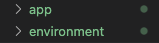

2. In our "Vagrantfile" we now need to add a configeration step to add this file to our VM directory. This tells the vm what folder to sync and the path we want to store it at.

`config.vm.synced_folder "app", "/home/vagrant/app"`

3. We can now `vagrant run`, once the VM has been created we can `cd app` to check if this file exists within our vm and `ls` to check the contents.

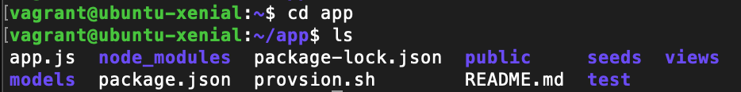

# Deploying an application on a VM

### Without provisioning:

1. Our VM that is on ubuntu OS will have python installed but we need to add  a python package manager, we can do this by opening a terminal-bash window, ssh into our vm and use the cmd:

- `sudo apt-get install python-software-properties`

2. Now to install node on a Linux system we have to use 2 commands to achieve this:

- `curl -sL https://deb.nodesource.com/setup_6.x | sudo -E bash -`

Once this is done, your window will display a message prompting you to input a new cmd, it should look something like: 

Run `sudo apt-get install -y nodejs` to install Node.js 6.x

*You can check your version of node.js by using `nodejs --version`*

3. We now want to install "PM2" this is an advanced process manager for running node.js apps, to do this we use:

- `sudo npm install pm2 -g`

4. Once that has completed we need to cd into our app folder

- `cd app`

5. Our final steps are to install npm within our application and starting it, we can do this with :

- `npm install`

and then:

- `npm start`

You should be greeted with this message.

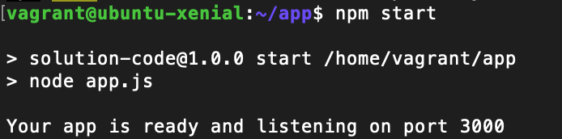

6. You can now copy your IP address and add your port on the end to direct you to your deployed application, in this case our code is: "http://192.168.10.100:3000/"

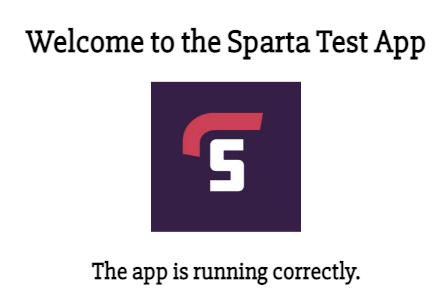

### With Provisioning:

1. Provisioning is the process of setting up the Vagrant box when it is ran for the first time. Provisioning will only run once for a new VM, unless forced.

This one specifically is executing a bunch of shell commands when it is being provisioned.

`config.vm.provision :shell do |shell|`

2. Within our "Vagrant" file we need to set up a provision to do all the instilations we need for the vm, we can do this with:

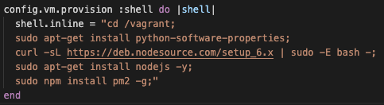

3. We then need to set up the provisions for the npm to start within the application directory. 

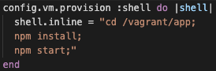

4. Now when we `vagrant up`, our vm should automatically deploy our application and return the same message and port number. we can return to this page and see if our application has been deployed. ("http://192.168.10.100:3000/")


## Creating 2 VM's through vagrant

 First thing we need to do is name our VM's so that vagrant can distinguish between the VM's we are creating, this also means we need to rename the processes of our vm to be the same as the name we have defined i.e. changing `config` to our vm name, And create the second VM following the same convention.

- ``` 
  config.vm.define "app" do |app|
  ```

Our Vagrantfile should now look something like.

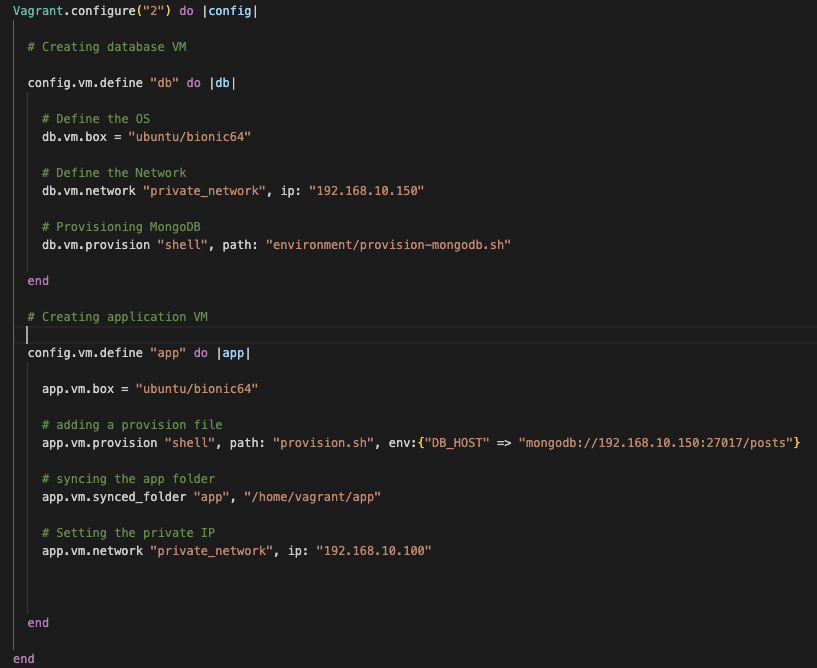

We can


### setting up mongoDB 

##### Without Provisioning:

1. Once we have vagrant up our 2 VM's, we need to open a terminal bash, cd to our vagrant file and ssh into our db VM

```
vagrant ssh db
```

2. Once we are in our VM we can go through these commands in succession.

```
sudo apt update -y

sudo apt upgrade -y

sudo apt-key adv --keyserver hkp://keyserver.ubuntu.com:80 --recv D68FA50FEA312927

echo "deb https://repo.mongodb.org/apt/ubuntu xenial/mongodb-org/3.2 multiverse" | sudo tee /etc/apt/sources.list.d/mongodb-org-3.2.list

sudo apt update -y

sudo apt upgrade -y

sudo apt-get install -y mongodb-org=3.2.20 mongodb-org-server=3.2.20 mongodb-org-shell=3.2.20 mongodb-org-mongos=3.2.20 mongodb-org-tools=3.2.20

sudo systemctl start mongod

sudo systemctl status mongod
```

3. The final command in this script will display a green "running" message to confirm the activation of our DB within this VM.

##### With provisioning:

1. We need to create a new provision script purely for the database and we need to put it in a different path to the app provision script. So we placed it in the environment folder and within our Vagrantfile we create a line for the it to know it needs to run the shell script on creation.

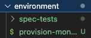

```
# Provisioning MongoDB 
    db.vm.provision "shell", path: "environment/provision-mongodb.sh"
```

3. Within the provision script this should include all the steps we took to manually install and run the mongodb and should look like this.

```
#!/bin/bash

sudo apt update -y

sudo apt upgrade -y

sudo apt-key adv --keyserver hkp://keyserver.ubuntu.com:80 --recv D68FA50FEA312927

echo "deb https://repo.mongodb.org/apt/ubuntu xenial/mongodb-org/3.2 multiverse" | sudo tee /etc/apt/sources.list.d/mongodb-org-3.2.list

sudo apt update -y

sudo apt upgrade -y

sudo apt-get install -y mongodb-org=3.2.20 mongodb-org-server=3.2.20 mongodb-org-shell=3.2.20 mongodb-org-mongos=3.2.20 mongodb-org-tools=3.2.20

sudo systemctl start mongod
```

4. We are now ready to `vagrant up` and with a `sudo systemctl status mongod` within our VM should return a green "active(Running)" message. 

# Connecting database

### Connecting your nodejs to your MongoDB

1. The first thing we need is our vagrant VM's both up and running, for this step it is good to note that we can provision both VM's but our app VM should not be provisioned to deploy!
<br>

2. We need two terminal/bash windows opened and each VM should be ssh'd into from a seperate window. 

``` 
vagrant ssh app
```
```
vagrant ssh db
```

3. Working with the db terminal we need to ammend the configeration file to allow network access from anyone using:

```
sudo nano /etc/mongod.conf
```

Once we are in the file scroll down to
the netwrok interfaces we can ammend the 
bindIP to "0.0.0.0" so anyone can access it.

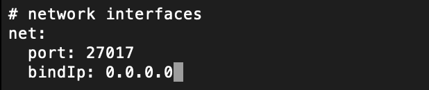

Once ammended `Ctrl+X`, `Y` and `Enter` to save these changes. Then to solidify this change we need to retart and enable the database.

```
sudo systemctl restart mongod

sudo systemctl enable mongod
```
We can then check the status of our db and should hopefully see a green confirmation of "running".

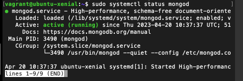
This is all we need to do with our DB, the next steps all take place within our app terminal.

4. We now need to create a persistant environment varialbe to be able to connect the database to our app. 

we need to access and ammend our `.bashrc` file

```
sudo nano .bashrc
``` 

Once in the file scroll to the bottom and add your variable like:

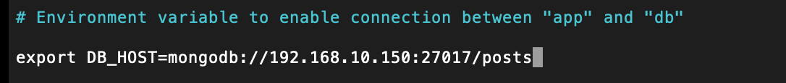

Again once ammended `Ctrl+X`, `Y` and `Enter` to save these changes. To solidify these changes we need to use the command:

```
source .bashrc
```

We can check it has been saved by searching for the variable.

```
printenv DB_HOST
```

Which should return the variable just made.

5. We can now change directory into our app, and run npm install.

```
cd app
npm install
```

When this happens this will show that you have a file that needs seeding. 

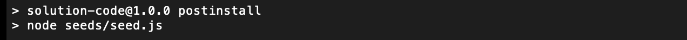

6. We can look at the files within the app to confirm this and input the command to seed the db.

<br>

7. The final step is to start your app. head over to your brower and input `http://192.168.10.100:3000/posts` which should take you to your posts page within your app that the db has seeded too. 


# Automating the process of app and db connection and deployment

### automating the setting of BindIP to 0.0.0.0

1. This is a simple step that consists of adding a line of code to our db provision file.

```
sudo sed -i "s,\\(^[[:blank:]]*bindIp:\\) .*,\\1 0.0.0.0," /etc/mongod.conf
```

After this we need to restart and enable our MongoDB, meaning our whole provision script should look something like 

```
#!/bin/bash

sudo apt update -y

sudo apt upgrade -y

sudo apt-key adv --keyserver hkp://keyserver.ubuntu.com:80 --recv D68FA50FEA312927

echo "deb https://repo.mongodb.org/apt/ubuntu xenial/mongodb-org/3.2 multiverse" | sudo tee /etc/apt/sources.list.d/mongodb-org-3.2.list

sudo apt update -y

sudo apt upgrade -y

sudo apt-get install -y mongodb-org=3.2.20 mongodb-org-server=3.2.20 mongodb-org-shell=3.2.20 mongodb-org-mongos=3.2.20 mongodb-org-tools=3.2.20

sudo systemctl start mongod

sudo sed -i "s,\\(^[[:blank:]]*bindIp:\\) .*,\\1 0.0.0.0," /etc/mongod.conf

sudo systemctl restart mongod

sudo systemctl enable mongod
```

2. We can check this by looking inside the `mongod.conf` file to check the BindIp and we should see:

```
sudo nano /etc/mongod.conf
```


